# RouteGuard

RouteGuard는 **실내 비상 대피 경로에 놓인 장애물과 잠재적 위험 요소를 탐지**합니다.

사용자가 실내 공간에서 출입구 또는 이동 방향을 향해 촬영한 **짧은 스마트폰 영상**을 업로드하면, 영상 속 객체와 **중앙 통로 후보 영역의 겹침 정도**를 분석해 통로를 방해할 가능성이 있는 물체를 찾아냅니다. 분석 결과는 **주석이 표시된 영상, 시간대별 위험 요소 목록, 대피 경로 점수**로 제공합니다.

자취방이나 기숙사뿐만 아니라 **연구실, 동아리방, 소형 사무실**과 같은 실내 공간에서도 활용할 수 있습니다.

## 주요 기능

- **짧은 실내 대피 경로 영상 업로드**
- 가방, 의자, 캐리어, 우산, 화분, 책, 병, 컵, 노트북 등 **통행을 방해할 수 있는 객체 후보 탐지**
- **통로 후보 영역과 장애물의 겹침 정도 계산**
- **시간대별 위험 요소 목록 및 대피 경로 점수 생성**
- **위험 객체가 표시된 결과 영상 제공**
- **정리 전후 영상 비교**를 통한 안전 점수 변화 확인
- 객체 후보 카운트, 위험 샘플 비율, 처리 속도 등 분석 근거 제공
- 결과 영상 및 텍스트 리포트 다운로드
- COCO에 없는 물체도 큰 박스가 통로와 반복적으로 겹치면 **"큰 물체 후보"**로 점수에 반영

## 프로젝트 목적

- 실내 공간에서 출입구까지 이어지는 **이동 경로가 물건으로 막혀 있는지** 빠르게 확인합니다.
- 사람이 눈으로만 판단하기 쉬운 통로 위험을 **객체 탐지, 통로 겹침 비율, 반복 감지**로 정량화합니다.
- **안전 점수와 시간대별 피드백**을 제공해 어떤 물체를 먼저 치워야 하는지 알려줍니다.
- **정리 전후 영상**을 같은 기준으로 비교해 실제로 통로가 개선되었는지 확인합니다.

## 주요 기능 정리

1. **영상 업로드 및 샘플 영상 분석**
   - Streamlit UI에서 사용자가 직접 촬영한 `mp4`, `mov`, `avi` 영상을 업로드할 수 있습니다.
   - 저장소에 포함된 safe, bag, chair, bad 샘플 영상으로 바로 테스트할 수 있습니다.

2. **YOLO 기반 객체 후보 탐지**
   - `yolo11n.pt` 모델을 사용해 실내 통로를 막을 가능성이 있는 객체 후보를 탐지합니다.
   - COCO 클래스에 없는 물체는 정확한 이름으로 분류되지 않을 수 있으므로, 물체 이름보다 박스 크기와 통로 겹침 여부를 중요하게 봅니다.

3. **중앙 통로 후보 영역 분석**
   - 영상 하단 중앙을 사람이 이동할 가능성이 높은 통로 후보 영역으로 가정합니다.
   - 객체 박스가 이 영역과 얼마나 겹치는지 계산해 위험도를 판단합니다.

4. **위험 이벤트 병합 및 점수 계산**
   - 한 프레임에만 잠깐 보인 오탐은 바로 감점하지 않고, 여러 샘플 프레임에서 반복될 때 위험 이벤트로 확정합니다.
   - 의자, 캐리어, 가방처럼 실제 통행을 크게 방해하는 물체는 더 큰 감점을 받습니다.

5. **결과 시각화**
   - 분석 결과 이미지와 GIF에 통로 영역, 방해물 박스, 위험도, 통로 겹침 비율을 표시합니다.
   - 감점 이벤트가 없는 안전 영상에서는 불필요한 위험 이미지를 보여주지 않고 "감점 이벤트 없음"으로 표시합니다.

6. **정리 전후 비교**
   - 같은 위치에서 촬영한 정리 전 영상과 정리 후 영상을 넣으면 안전 점수와 위험 이벤트 변화를 비교합니다.
   - README 데모나 실제 점검 기록으로 사용하기 좋습니다.

## 왜 RouteGuard가 필요한가?

실내 통로 위험은 사람이 직접 봐도 어느 정도 알 수 있지만, 익숙한 공간에서는 어느 시점에 어떤 물체가 통로를 막았는지 과소평가하기 쉽습니다. RouteGuard는 사람이 감으로 판단하는 장면을 **객관적인 기준으로 정량화**합니다.

- 프레임별로 객체 후보를 탐지하고, 이동 경로 후보 영역과의 겹침 정도를 계산합니다.
- 같은 위험 후보가 여러 프레임에서 반복되는지 확인해 순간적인 오탐을 줄입니다.
- 결과를 **안전 점수, 시간대별 피드백, 주석 영상**으로 저장해 정리 전후 비교와 README 데모에 활용할 수 있습니다.
- 법적 안전 인증 도구가 아니라, 실내 대피 경로를 빠르게 점검하는 보조 도구를 목표로 합니다.

기존 객체 탐지 데모가 **"무엇이 보이는가"**에 집중한다면, RouteGuard는 **"그 물체가 실제로 이동 경로를 막는가"**에 집중합니다. 따라서 물체 이름이 완벽히 맞지 않아도, 중앙 통로를 크게 차지하고 반복적으로 보이는 큰 물체라면 위험 후보로 반영합니다.

## 현재 탐지 후보

YOLO 사전학습 모델이 인식할 수 있는 COCO 클래스 중 실내 통로 위험과 관련된 후보를 사용합니다.

- 큰 장애물: 가방, 의자, 캐리어, 우산, 화분, 소파
- 가구성 장애물: 침대, 벤치, 테이블
- 작은 물건 후보: 책, 병, 컵, 그릇, 노트북, 키보드, 마우스, 공, 보드, 인형, 화병

작은 물건은 오탐을 줄이기 위해 통로 중앙과 크게 겹치고 여러 샘플 프레임에서 반복될 때만 점수에 반영합니다. 선풍기, 박스처럼 COCO에 정확한 클래스가 없거나 다른 이름으로 오인되는 물체도 큰 박스로 탐지되고 통로와 겹치면 "큰 물체 후보"로 처리합니다.

## 처리 과정

```text
영상 업로드
  -> 프레임 추출
  -> 객체 탐지
  -> 통로 후보 영역 분석
  -> 위험도 점수 계산
  -> 주석 영상 및 리포트 생성
```

## Architecture Overview

- `app.py`
  - Streamlit 웹 UI를 담당합니다.
  - 영상 업로드, 샘플 선택, 단일 영상 분석, 정리 전후 비교, 결과 다운로드 화면을 렌더링합니다.

- `src/detector.py`
  - Ultralytics YOLO 모델을 로드하고, 실내 통로 위험과 관련된 객체 후보만 필터링합니다.
  - confidence threshold와 입력 이미지 크기는 `src/config.py`의 설정을 사용합니다.

- `src/path_analyzer.py`
  - 프레임 하단 중앙의 사다리꼴 영역을 통로 후보 영역으로 설정합니다.
  - 탐지된 객체 박스와 통로 후보 영역의 겹침 비율, 박스 크기, 중심점 위치를 계산합니다.

- `src/risk_rules.py`
  - 객체 종류, 위험도, 통로 겹침, 반복 감지를 바탕으로 감점 규칙을 적용합니다.
  - 최종 안전 점수와 위험 수준을 계산합니다.

- `src/video_analyzer.py`
  - 영상 프레임을 순회하며 탐지, 통로 분석, 이벤트 병합, 결과 영상/GIF/대표 이미지 생성을 수행합니다.
  - 최종 시간대별 이벤트 중 감점이 가장 큰 이벤트를 대표 장면으로 선택합니다.

- `src/visualizer.py`
  - 통로 영역, 방해물 박스, 위험도 라벨, 요약 패널을 프레임 위에 그립니다.

- `src/reporting.py`
  - 시간대별 발견 내용, 개선 피드백, 텍스트 리포트, 정리 전후 비교 요약을 생성합니다.

## 프로젝트 구조

```text
routeguard/
  app.py                    # Streamlit 웹 애플리케이션 진입점
  src/
    config.py               # 공통 설정
    detector.py             # 객체 탐지
    path_analyzer.py        # 통로 후보 영역 분석
    risk_rules.py           # 위험도 점수 계산 규칙
    reporting.py            # 결과 요약, 피드백, 전후 비교 리포트
    sample_report.py        # 샘플 영상 분석 요약 유틸리티
    visualizer.py           # 결과 영상 및 리포트 생성
    video_analyzer.py       # 영상 분석 파이프라인
  data/
    samples/                # 데모용 짧은 영상
  assets/                   # README 스크린샷 및 데모 미디어
  outputs/                  # 생성된 결과 파일 (Git 제외)
  tests/                    # 위험도 계산 규칙 테스트
```


## 실행 방법

### 1. 가상 환경 생성

```bash
python -m venv .venv
```

### 2. 가상 환경 활성화

Windows PowerShell:

```powershell
.\.venv\Scripts\Activate.ps1
```

### 3. 의존성 설치

```bash
pip install -r requirements.txt
```

### 4. 애플리케이션 실행

```bash
streamlit run app.py
```

## 앱 사용 방법

1. 단일 영상 분석 탭에서 **파일을 업로드하거나 샘플 영상을 선택**합니다.
2. 분석 결과에서 **안전 점수, 위험 수준, 시간대별 위험 이벤트, 결과 영상**을 확인합니다.
3. 정리 전후 비교 탭에서 같은 위치에서 촬영한 두 영상을 비교해 **점수 변화**를 확인합니다.

## UI 사용 흐름

### 단일 영상 분석

1. `내 통로 점검` 탭을 엽니다.
2. 파일 업로드 또는 샘플 영상을 선택합니다.
3. `분석 시작` 버튼을 누릅니다.
4. 안전 점수, 위험 수준, 위험 이벤트 수, 최대 통로 겹침, 처리 속도를 확인합니다.
5. 분석 결과 미리보기에서 **가장 큰 감점 이벤트가 표시된 대표 장면**을 확인합니다.
6. 시간대별 발견 내용에서 **객체, 위험도, 통로 겹침, 반복 횟수, 감점, 피드백**을 확인합니다.

### 정리 전후 비교

1. `정리 전후 비교` 탭을 엽니다.
2. 정리 전 영상에는 통로가 막힌 영상을 넣습니다.
3. 정리 후 영상에는 같은 위치에서 물건을 치운 영상을 넣습니다.
4. 두 영상을 같은 기준으로 분석해 점수 변화와 위험 이벤트 변화를 확인합니다.

## Demo & Screenshots


### 영상 업로드 화면

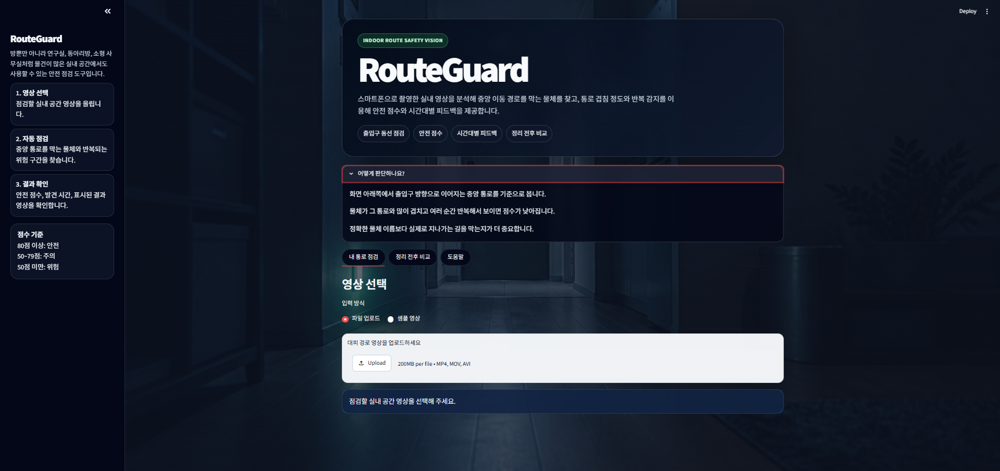

### 안전한 영상 분석 결과

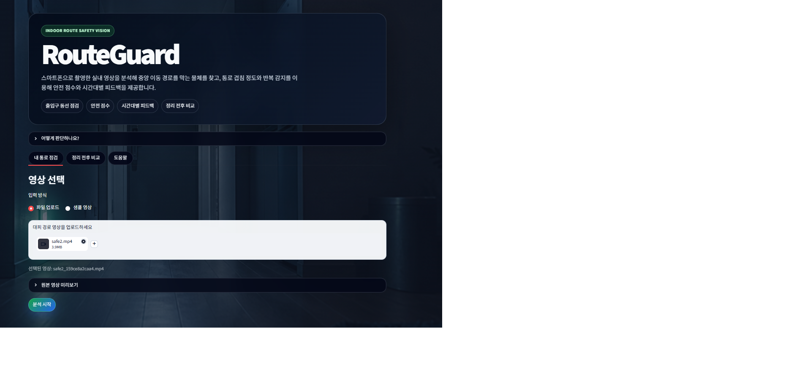

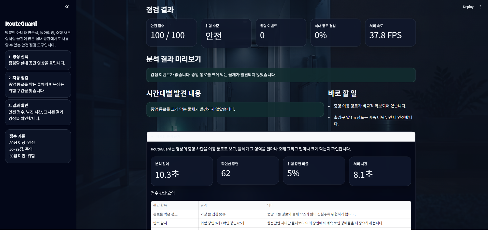

### 위험 물체 3개 이상인 영상

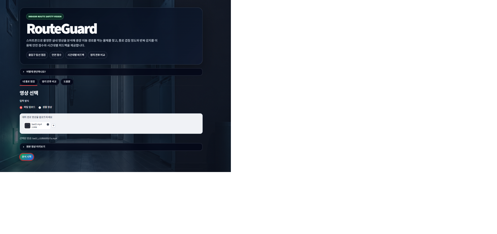

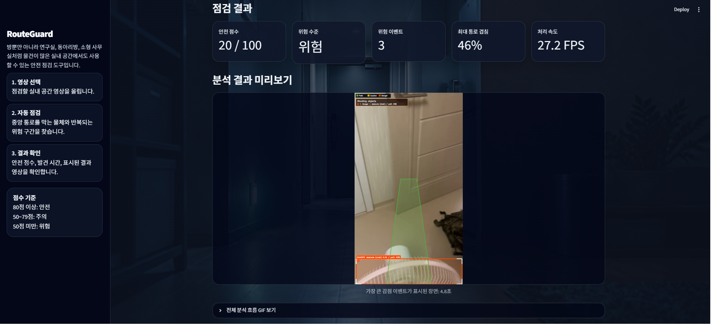

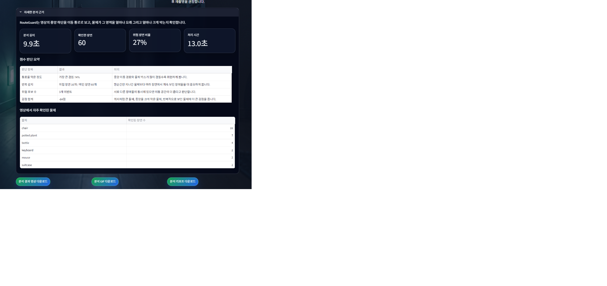

### 위험 물체 1개인 영상

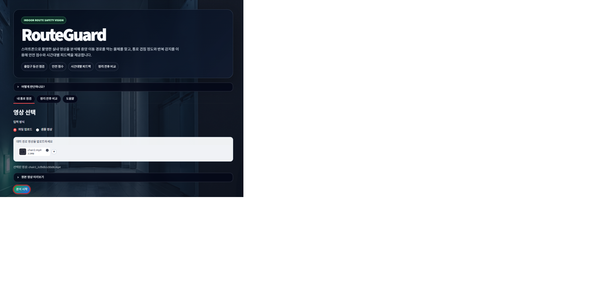

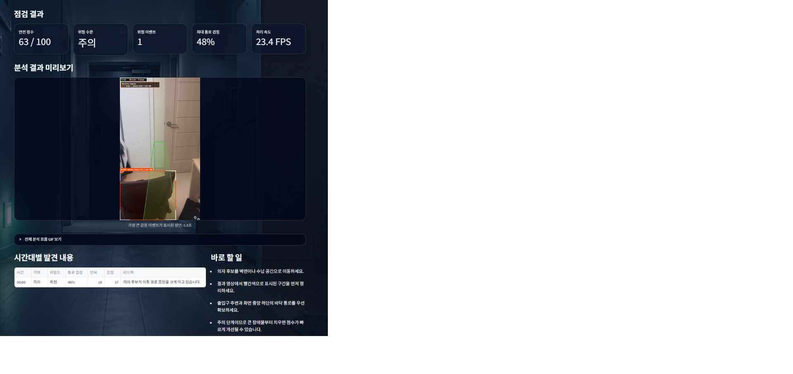

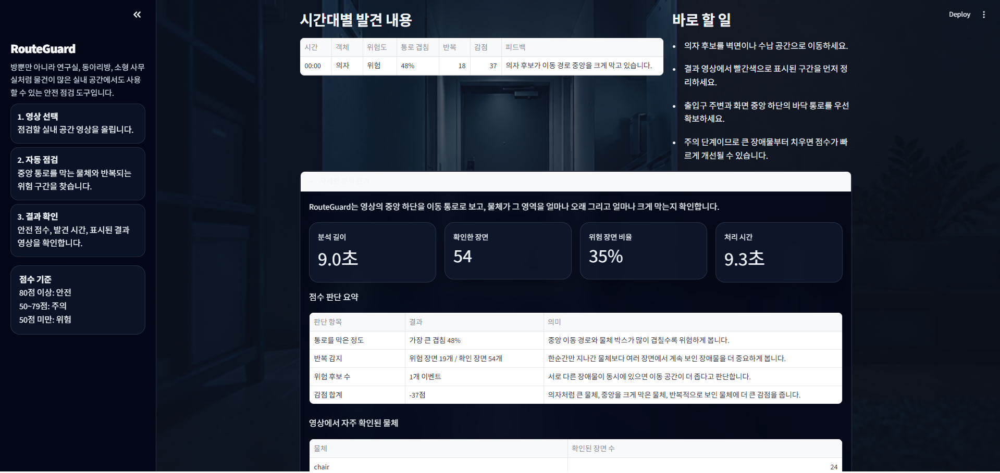

### 정리 전후 비교 결과

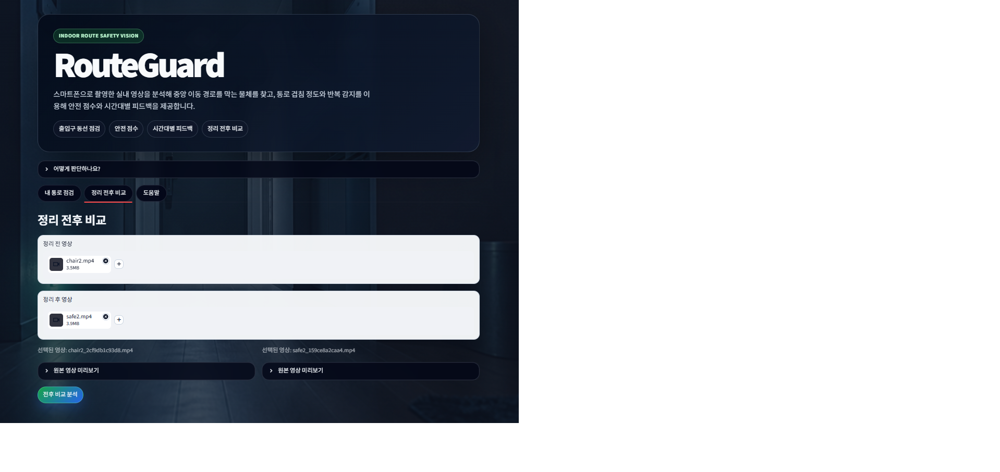

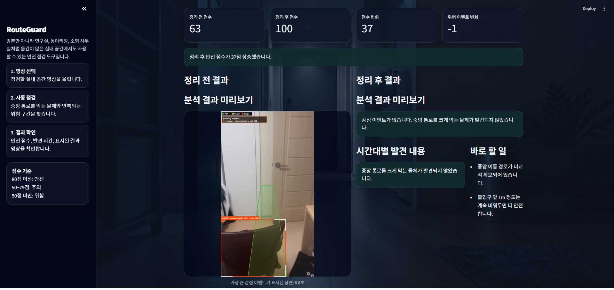

## 기본 분석 설정

사용자가 임의로 튜닝하지 않아도 바로 분석할 수 있도록 **설정을 고정**했습니다.

| 설정 | 값 | 설정 의도 |
| --- | --- | --- |
| 모델 | `yolo11n.pt` | 웹 데모에서 끊김 없이 동작하는 속도를 우선했습니다. 더 큰 모델은 정확도가 올라갈 수 있지만, 제출 환경에서 가중치 다운로드와 실행 시간이 부담될 수 있어 가장 안정적인 nano 모델로 고정했습니다. |
| 탐지 confidence threshold | `0.35` | 너무 높이면 어두운 실내 영상이나 흔들린 영상에서 가방, 의자 후보를 놓칠 수 있습니다. 너무 낮으면 작은 오탐이 많아지므로, 실내 샘플 영상에서 장애물 후보를 놓치지 않으면서 오탐을 후속 통로 겹침 규칙으로 걸러낼 수 있는 중간값으로 설정했습니다. |
| YOLO 입력 크기 | `640` | 작은 물체와 큰 장애물 박스를 모두 어느 정도 유지하면서 처리 속도도 확보할 수 있는 기본 해상도입니다. `416`은 빠르지만 작은 후보가 약해지고, `768` 이상은 데모 환경에서 처리 시간이 늘어납니다. |
| 중앙 통로 폭 비율 | `0.42` | 스마트폰으로 출입구 방향을 촬영할 때 사람이 실제로 지나갈 중앙 하단 영역을 기준으로 잡았습니다. 너무 넓게 잡으면 벽면 물건까지 위험으로 잡고, 너무 좁게 잡으면 실제 통로를 막는 의자나 가방 일부를 놓칠 수 있습니다. |
| 프레임 샘플 간격 | `5` | 모든 프레임에 YOLO를 돌리면 느려지기 때문에 5프레임마다 탐지합니다. 짧은 영상에서도 장애물이 여러 번 확인되며, Streamlit 데모에서 분석 속도를 유지할 수 있습니다. |
| 위험 반복 최소 횟수 | `2` | 한 프레임에만 잠깐 보인 오탐은 위험 이벤트로 확정하지 않기 위한 기준입니다. 같은 후보가 최소 2번 이상 확인되면 실제로 통로에 놓인 물체일 가능성이 높다고 판단했습니다. |
| 최대 분석 길이 | `20초` | 업로드 영상이 길어져도 분석 시간이 과도하게 늘어나지 않도록 제한했습니다. 본 프로젝트의 목표는 긴 CCTV 분석이 아니라, 사용자가 직접 촬영한 짧은 실내 점검 영상 분석입니다. |
| 안전 후보 박스 표시 | `False` | 결과 영상에서는 실제로 통로를 방해하는 후보만 강조합니다. 안전한 물체까지 모두 표시하면 화면이 복잡해져 사용자가 중요한 위험 후보를 보기 어렵기 때문입니다. |

점수는 탐지된 객체 후보가 **중앙 통로 영역과 얼마나 겹치는지**, 같은 위험이 **여러 샘플 프레임에서 반복되는지**, 물체 종류가 통행에 얼마나 방해되는지를 기준으로 계산합니다. 예를 들어 **의자나 테이블처럼 다리와 부피가 있는 가구는 가방보다 더 큰 감점**을 받습니다.
위험 이벤트가 **3개 이상**이면 여러 물체가 동시에 통로를 막는 **혼잡 상황**으로 보고 추가 감점을 적용합니다.

### 설정값을 고정한 이유

초기 버전에서는 confidence, 입력 크기, 프레임 간격 등을 사용자가 조절할 수 있게 만들 수 있었지만, 최종 제출 버전에서는 조절 UI를 제거했습니다. 이 프로젝트는 모델 튜닝 도구가 아니라 실내 통로 점검 서비스이므로, 사용자가 값을 바꾸지 않아도 바로 결과를 확인하는 흐름이 더 적합하다고 판단했습니다.

## 기술 스택

- Python
- Streamlit
- Ultralytics YOLO
- OpenCV
- NumPy
- Pillow

## 참고 모델 및 라이브러리

- Ultralytics YOLO11 `yolo11n.pt`: COCO 사전학습 객체 탐지 모델
- OpenCV: 프레임 추출, 영상 저장, 통로 영역 및 박스 시각화
- Streamlit: 영상 업로드와 분석 결과 웹 UI
- pandas: 시간대별 위험 이벤트 표 표시
- Pillow: 분석 GIF 생성

## Known Issues / Troubleshooting

- **분석 결과가 예전 이미지처럼 보일 때**
  - Streamlit 세션에 이전 분석 결과가 남아 있을 수 있습니다.
  - 브라우저를 새로고침하거나 Streamlit 서버를 재시작한 뒤 다시 분석합니다.

- **영상 플레이어가 검게 보일 때**
  - 브라우저와 MP4 코덱 조합에 따라 Streamlit 영상 플레이어가 정상 재생되지 않을 수 있습니다.
  - 이 경우 결과 화면의 대표 이미지와 GIF 미리보기, 다운로드 파일을 사용합니다.

- **선풍기, 박스, 전선 이름이 정확히 나오지 않을 때**
  - YOLO COCO 기본 클래스에 없는 물체는 정확한 이름으로 표시되지 않을 수 있습니다.
  - RouteGuard는 물체 이름보다 중앙 통로를 실제로 막는지에 집중합니다.

- **안전 영상인데 작은 물체가 잠깐 탐지될 때**
  - 한 프레임짜리 오탐은 최종 위험 이벤트에서 제외합니다.
  - 최종 이벤트가 0개이면 감점 이벤트 없음으로 표시합니다.

## 향후 개선 방향

- 직접 촬영한 실내 장애물 데이터셋을 라벨링해 RouteGuard 전용 YOLO 모델로 파인튜닝
- 선풍기, 박스, 전선, 멀티탭, 소화기 등 COCO에 없는 클래스 추가
- Depth Anything 등 단안 깊이 추정 모델을 이용한 가까운 장애물 가중치 보정
- SAM 또는 segmentation 모델을 이용한 바닥/통로 영역 자동 추정
- 여러 영상의 점수 변화를 저장해 공간별 안전 점검 이력 관리

## 사용 라이선스 및 출처

- Ultralytics YOLO / Ultralytics package: AGPL-3.0, https://github.com/ultralytics/ultralytics
- OpenCV: Apache-2.0, https://github.com/opencv/opencv
- Streamlit: Apache-2.0, https://github.com/streamlit/streamlit
- pandas: BSD-3-Clause, https://github.com/pandas-dev/pandas
- NumPy: BSD-3-Clause, https://github.com/numpy/numpy
- Pillow: HPND, https://github.com/python-pillow/Pillow
- PyTorch: BSD-style, https://github.com/pytorch/pytorch

## 한계점

- 기본 YOLO 모델이 모든 물체 이름을 정확히 맞히지는 못합니다. 예를 들어 **선풍기처럼 COCO에 없는 물체**는 `chair`, `suitcase` 등 비슷한 큰 객체 후보로 잡힐 수 있습니다.
- 단안 영상만 사용하므로 **실제 거리(cm, m)를 측정하지 않습니다.** 대신 화면상 통로 겹침 정도와 반복 감지를 기준으로 위험 후보를 계산합니다.
- **조명, 흔들림, 촬영 각도**에 따라 탐지 결과가 달라질 수 있습니다.
- **전선, 콘센트, 멀티탭처럼 작고 얇은 물체**는 사전학습 모델만으로 안정적으로 탐지하기 어렵습니다.

## 라이선스

이 프로젝트는 [MIT License](LICENSE)를 따릅니다.
